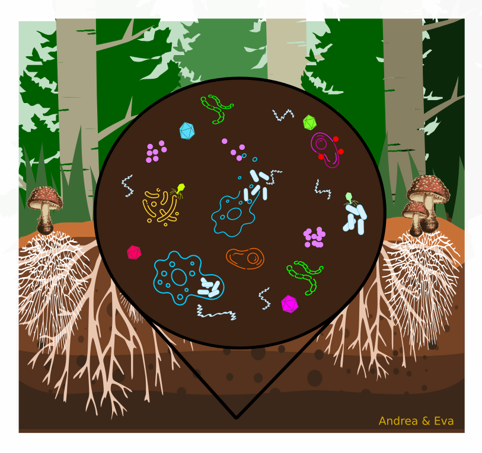

### Project Summary
<figure>

</figure>   
Our climate crisis, resulting from changes in interacting climate variables (temperature, rainfall, atmospheric chemistry) over the last century, has impacted all ecosystems on the surface of the Earth. The Ecological Metagenome-derived Reference Genomes and Traits (EMERGENT) synthesis project connects genomic information about the soil microbiome with the broader ecological context. Our work will advance efforts to harmonize molecular information for microbial taxa and their functional traits, streamline their use in syntheses with related ecosystem level data, and enable future metagenomic studies to leverage EDI environmental data, spurring future microbial ecology research at LTER sites.
 

### Principal Investigators

* [Jeff Blanchard](http://www.bio.umass.edu/micro/blanchard/), UMass Amherst/HFR
* [Janet Jansson](https://www.pnnl.gov/people/janet-jansson), Pacific Northwest National Laboratory (retired)
* [Jorge Rodrigues](http://lawr.ucdavis.edu/people/faculty/rodrigues-jorge), UC Davis
* [Lee Stanish](https://www.usgs.gov/staff-profiles/lee-stanish), US Geological Survey, US Department of Interior
* [Margaret O’Brien](https://msi.ucsb.edu/people/research-scientists/margaret-obrien), UC Santa Barbara
* [Jason McDermott](https://www.pnnl.gov/science/staff/staff_info.asp?staff_num=7039), Pacific Northwest National Laboratory
 

### Participants & Collaborators

Elsa Abs, Caitlin Broderick, Pete Churckran, Hugh Cross, Emiley Eloe-Fadrosh, Sarah Evans, Dawson Fairbanks, Rachel Gallery, Adina Howe, Jennifer Jones, Linda Kinkel, William Nelson, Margaret O’Brien, Petar Penev, Jennifer Pett-Ridge, Sydne Record, William Rodriguez-Reillo, Ashley Shade, Tina Takacs-Vesbach, Danaiijah Vilsaint, Ruonan Wu, Kate Lajtha, Kristen Vanderbilt and Emery Boose
 

Award Date: January 9, 2020
Proposed End Date: September 30, 2024

### EMERGENT GitHub Repository

We will be making all code for this project available through the [EMERGENT GitHub Repository](https://github.com/lter/lterwg-emergent)